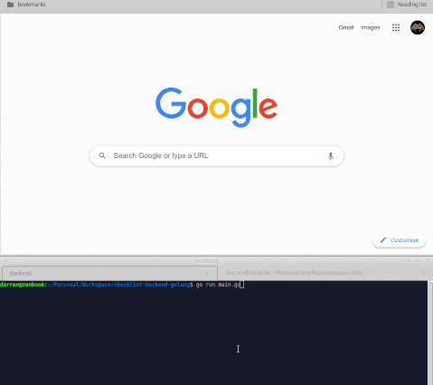

# Quasar Todo (quasar-todo)



* [Quasar v1 video tutorial](https://youtu.be/GV-D85D9KJQ)
* [Quasar v2 upgrade guide](https://next.quasar.dev/start/upgrade-guide)

## Backend

Start up the minimal [backend](https://github.com/TheInvader360/checklist-backend-golang) before starting the quasar frontend.

## Install the dependencies
```bash
npm install
```

### Start the app in development mode (hot-code reloading, error reporting, etc.)
```bash
quasar dev
```

### Build the app for production
```bash
quasar build
```

### Customize the configuration
See [Configuring quasar.conf.js](https://v1.quasar.dev/quasar-cli/quasar-conf-js).
